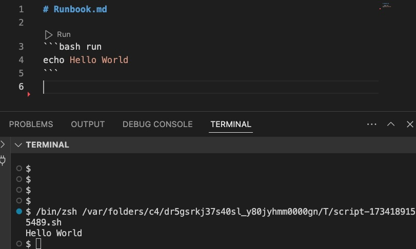
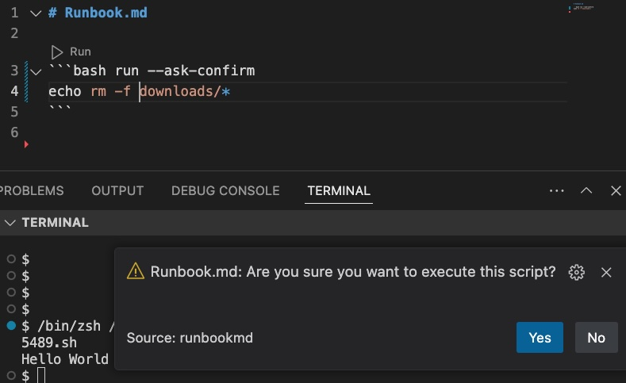
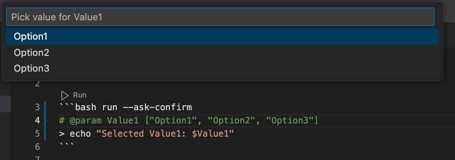

# Runbook.md

Runbook.md is a VSCode extension that enables running scripts in a code block from Markdown files directly with a single click.

Note: This extension has been tested on macOS and Linux environments. Windows compatibility is not currently guaranteed.

# Example Usage



Define a code block with `bash run`, and Runbook.md will display a `Run` button above it. Clicking the button will open or create a terminal and execute the script.

# Features

- Execute Code Blocks: Run scripts directly from Markdown code blocks with a single click or keyboard shortcut.
- Terminal Integration: Automatically opens or creates a terminal to execute scripts, ensuring a seamless workflow.
- User Confirmation: Add `--ask-confirm` to code blocks to prompt for user confirmation before executing potentially dangerous scripts.
- Parameters:
  - Form Parameters: Define and use form parameters in your scripts for interactive input collection (e.g., `# @param Value1`).
  - Custom Terminal Names: Specify custom terminal names for script execution using the `--terminal` argument.
  - Working Directory Control: Set the working directory for script execution with the `--cwd` argument.

# Installation 

You may install this extension via the Visual Studio Marketplace at
https://marketplace.visualstudio.com/items?itemName=ubw.runbookmd

Then open the [Example Markdown](./examples/walkthrough/README.md) to try the features.

# Usage

# Arguments

You can add arguments to code blocks to modify their execution behavior.

## Set Terminal Name

`-t, --terminal [TERMINAL_NAME]`

By default, Runbook.md executes scripts in a terminal named "Runbook.md". You can specify a different terminal name using `--terminal TERMINAL_NAME`.

Example:

> \```bash run --terminal=MyTerminal
> 
> echo Hello MyTerminal
> 
> \```

## Set Working Directory

`-d, --cwd [DIRECTORY]`

The `--cwd` argument allows you to specify the working directory in which the script should be executed. If not provided, the script will run in the current directory. This can be useful for scripts that depend on being run from a specific directory.

Example:

> \```bash run --cwd ~/Documents
> 
> ls # List files in ~/Documents
> 
> \```

## User Confirmation

`--ask-confirm`

It is recommended to add this argument when executing potentially dangerous scripts that require careful attention.



# Using Form Parameters

You can define form parameters within your code blocks to capture user input or provide options for script execution. This is done using the `# @param` annotation.

### Defining Form Parameters

To define a form parameter, use the `# @param` annotation followed by the parameter name. You can also provide a list of options in JSON format.

Example:

> \```bash run
> 
> \# @param Value1
> 
> \# @param Value2 ["Option1", "Option2", "Option3"]
> 
> echo "Selected Value1: $Value1"
> 
> echo "Selected Value2: $Value2"
> 
> \```

**Explanation:**

- **Parameter Definition**: `# @param Value1` defines a parameter named `Value1`.
- **Options**: `# @param Value2 ["Option1", "Option2", "Option3"]` defines a parameter `Value2` with a list of options.

These parameters can be used within your script to customize its behavior based on user input or predefined options.



# Commands

## `run`

Executes your script in the terminal by copying the content to a temporary file and running `${SHELL} ${TMP_FILE}`.

Example usage:

> \```bash run
>
> ls
> 
> \```

## `send`

Sends the content directly to the terminal. Unlike the `run` command, which stops on errors when `set -e` is used, content sent this way will continue executing even if errors occur. Choose the mode that best suits your needs.

> \```bash send
>
> ls
> 
> \```

# Keyboard Shortcuts

Press `Shift+Enter` while your cursor is inside a code block to execute it. This works the same way as clicking the `Run` | `Send` button above the code block.

For example, place your cursor inside this code block and press `Shift+Enter`:

> \```bash run
>
> echo "Hello from Runbook.md!" # Press shift+enter inside the code block
>
> \```

The shortcut will only work if:
- The file is a Markdown document.
- Your cursor is inside a code block with a valid annotation (e.g., `bash run`).
- You are not currently using the Find/Replace dialog.

